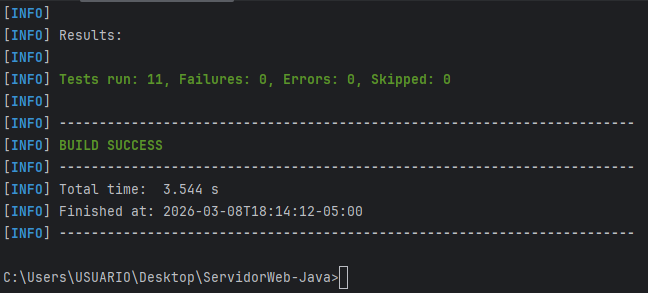
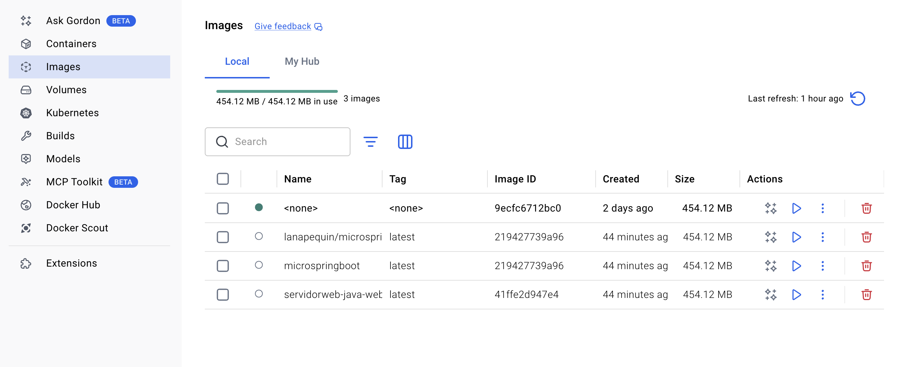
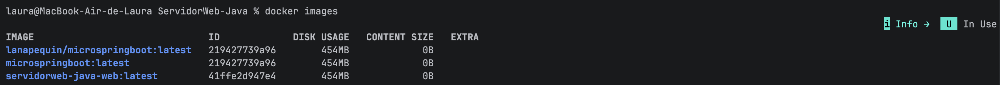
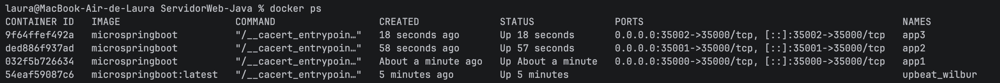
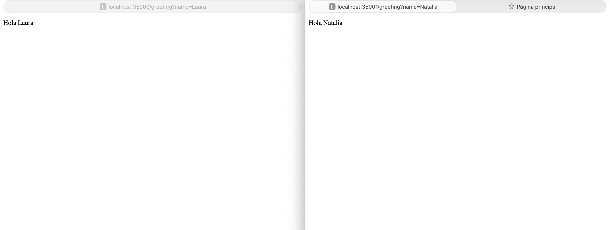
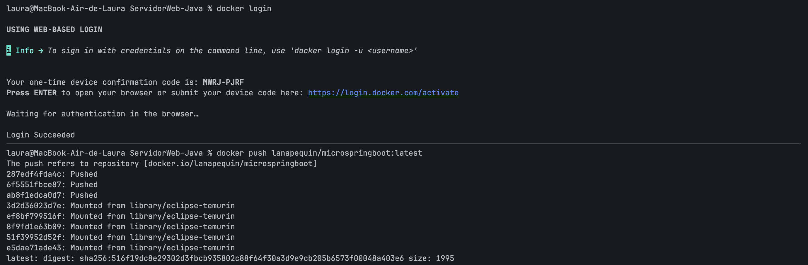
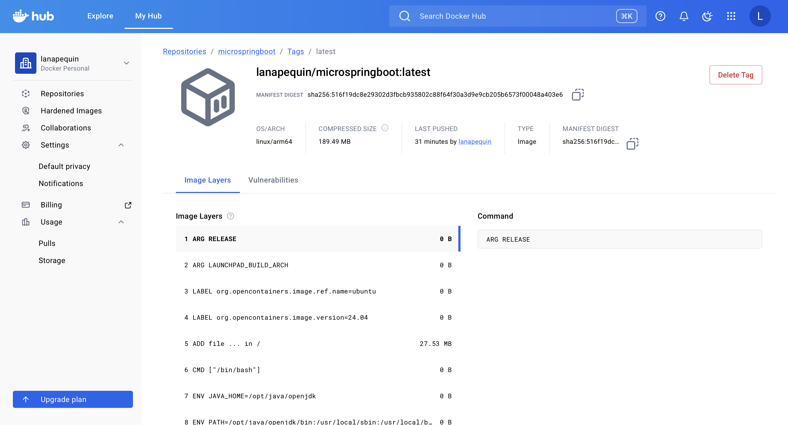
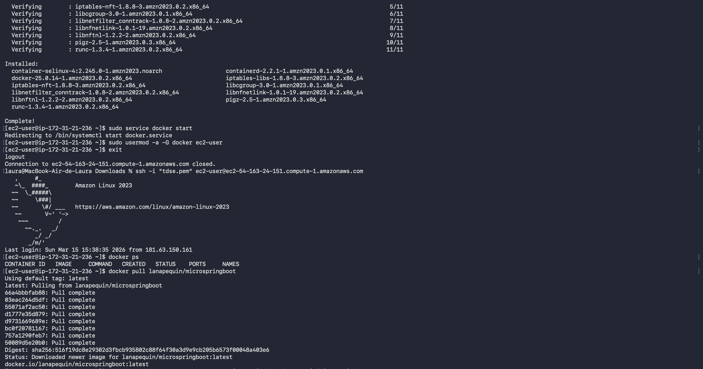
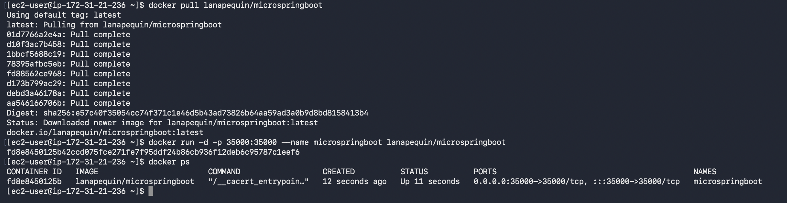
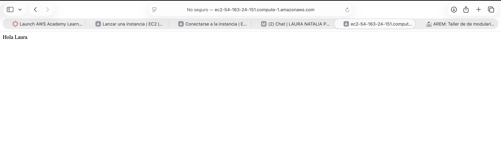

# MicroSpringBoot — Framework IoC con Docker y AWS

**Estudiante:** Laura Natalia Perilla Quintero  

Mini framework IoC en Java puro que replica el comportamiento de Spring Boot usando reflexión y anotaciones personalizadas, sin ninguna dependencia de Spring. En esta versión el servidor es concurrente (ThreadPool) y soporta apagado elegante mediante un JVM Shutdown Hook. El sistema se despliega en un contenedor Docker corriendo en una instancia EC2 de AWS.

---

## Tabla de contenidos

1. [Descripción del proyecto](#descripción-del-proyecto)
2. [Cambios respecto a la versión anterior](#cambios-respecto-a-la-versión-anterior)
3. [Arquitectura](#arquitectura)
4. [Diseño de clases](#diseño-de-clases)
5. [Prerrequisitos](#prerrequisitos)
6. [Clonar y ejecutar localmente](#clonar-y-ejecutar-localmente)
7. [Despliegue con Docker local](#despliegue-con-docker-local)
8. [Publicar imagen en Docker Hub](#publicar-imagen-en-docker-hub)
9. [Despliegue en AWS EC2](#despliegue-en-aws-ec2)
10. [Endpoints disponibles](#endpoints-disponibles)
11. [Tests automatizados](#tests-automatizados)
12. [Evidencia de despliegue](#evidencia-de-despliegue)
13. [Video de demostración](#video-de-demostración)

---

## Descripción del proyecto

MicroSpringBoot es un servidor HTTP y contenedor IoC construido desde cero en Java puro. El framework:

- Escanea el classpath buscando clases anotadas con `@RestController`
- Registra sus métodos `@GetMapping` como rutas HTTP dinámicamente
- Resuelve parámetros de query string mediante `@RequestParam` con soporte de `defaultValue`
- Sirve archivos estáticos (HTML, CSS, JS, PNG) desde `/webroot`
- Atiende múltiples solicitudes **de forma concurrente** usando un pool de hilos
- Se apaga **de manera elegante** al recibir Ctrl+C o SIGTERM (`docker stop`)

Todo usando únicamente la API de reflexión de Java (`Class.forName`, `isAnnotationPresent`, `method.invoke`). No usa Spring.

---

## Cambios respecto a la versión anterior

### Archivos modificados

| Archivo | Cambio |
|---|---|
| `MicroSpringBoot.java` | Concurrencia con `ExecutorService` + Graceful Shutdown Hook |
| `pom.xml` | Se agregó `maven-dependency-plugin` para copiar JARs a `target/dependency/` |

### Archivos nuevos

| Archivo | Descripción |
|---|---|
| `Dockerfile` | Imagen basada en `eclipse-temurin:17-jdk`, copia `target/classes` y `target/dependency` |
| `docker-compose.yml` | Configuración para levantar el contenedor con un solo comando |

---

### 1. Servidor concurrente con ThreadPool

La versión anterior procesaba solicitudes de forma secuencial: mientras atendía una conexión, todas las demás esperaban bloqueadas. Ahora cada solicitud se despacha a un hilo libre del pool:

```java
private static final int THREAD_POOL_SIZE = 10;
private static ExecutorService threadPool;
private static final AtomicBoolean running = new AtomicBoolean(true);

private static void startServer() throws IOException {
    threadPool = Executors.newFixedThreadPool(THREAD_POOL_SIZE);
    serverSocket = new ServerSocket(PORT);

    while (running.get()) {
        Socket clientSocket = serverSocket.accept();
        // Delega a un hilo libre — no bloquea el ciclo principal
        threadPool.submit(() -> handleRequest(clientSocket));
    }
}
```

El nombre del hilo aparece en cada línea de log para evidenciar la concurrencia:

```
[pool-1-thread-1] >> GET /hello HTTP/1.1
[pool-1-thread-3] >> GET /greeting?name=Ana HTTP/1.1
[pool-1-thread-2] >> GET /counter HTTP/1.1
```

### 2. Apagado elegante con JVM Shutdown Hook

Al recibir Ctrl+C o una señal SIGTERM (como hace `docker stop`), el servidor ejecuta una secuencia de cierre ordenada en un hilo separado. Referencia: https://www.baeldung.com/jvm-shutdown-hooks

```java
private static void registerShutdownHook() {
    Runtime.getRuntime().addShutdownHook(new Thread(() -> {
        running.set(false);                                // 1. Detener el ciclo de aceptación
        serverSocket.close();                              // 2. Liberar el puerto
        threadPool.shutdown();                             // 3. No aceptar nuevas tareas
        threadPool.awaitTermination(30, TimeUnit.SECONDS); // 4. Esperar tareas en vuelo
    }, "shutdown-hook"));
}
```

Al ejecutar `docker stop` se puede ver en los logs:

```
[Shutdown] Señal de apagado recibida. Cerrando servidor...
[Shutdown] ServerSocket cerrado.
[Shutdown] Pool de hilos terminado.
[Shutdown] Servidor apagado correctamente.
```

---

## Arquitectura

```
Cliente HTTP
     │
     ▼
┌────────────────────────────────────────────────────┐
│                  MicroSpringBoot                   │
│                                                    │
│   ServerSocket  ──accept()──►  ExecutorService     │
│   (puerto 35000)               (10 hilos fijos)    │
│                                      │             │
│                               handleRequest()      │
│                                      │             │
│                    ┌─────────────────┴──────────┐  │
│                    │                            │  │
│             Ruta dinámica              Archivo  │  │
│             (@GetMapping)             estático  │  │
│                    │                 (/webroot) │  │
│             Reflexión                           │  │
│             method.invoke()                     │  │
│             @RequestParam                       │  │
│                                                 │  │
│   ShutdownHook (hilo separado)                  │  │
│     └─► running=false → cierra socket           │  │
│         → drena pool                            │  │
└────────────────────────────────────────────────────┘
```

### Estructura del proyecto

```
reflexionlab/
├── Dockerfile                          ← imagen Docker (openjdk:17)
├── docker-compose.yml                  ← orquestación local
├── pom.xml                             ← build con maven-dependency-plugin
├── .gitignore
├── README.md
└── src/
    ├── main/
    │   ├── java/co/edu/escuelaing/reflexionlab/
    │   │   ├── MicroSpringBoot.java    ← servidor HTTP + IoC + concurrencia + shutdown
    │   │   ├── RestController.java     ← anotación @RestController
    │   │   ├── GetMapping.java         ← anotación @GetMapping
    │   │   ├── RequestParam.java       ← anotación @RequestParam
    │   │   ├── HelloController.java    ← controlador de ejemplo
    │   │   └── GreetingController.java ← controlador con @RequestParam
    │   └── resources/webroot/
    │       └── index.html
    └── test/java/
        └── MicroSpringBootTest.java    ← 11 tests JUnit 5
```

---

## Diseño de clases

### Anotaciones personalizadas

Las tres anotaciones replican el comportamiento de Spring sin usar ninguna dependencia externa. Todas tienen `RetentionPolicy.RUNTIME` para que sean visibles por reflexión en tiempo de ejecución.

```java
// Marca una clase como controlador REST — equivale a @RestController de Spring
@Retention(RetentionPolicy.RUNTIME)
@Target(ElementType.TYPE)
public @interface RestController { }

// Mapea un método HTTP GET a una URI — equivale a @GetMapping de Spring
@Retention(RetentionPolicy.RUNTIME)
@Target(ElementType.METHOD)
public @interface GetMapping {
    String value(); // path HTTP, ej: "/greeting"
}

// Resuelve un query param con valor por defecto — equivale a @RequestParam de Spring
@Retention(RetentionPolicy.RUNTIME)
@Target(ElementType.PARAMETER)
public @interface RequestParam {
    String value();
    String defaultValue() default "";
}
```

### Controladores de ejemplo

```java
@RestController
public class HelloController {

    @GetMapping("/")
    public String index() {
        return "Hola mundo desde MicroSpringBoot!";
    }

    @GetMapping("/hello")
    public String hello() {
        return "Hello from MicroSpringBoot Framework!";
    }
}

@RestController
public class GreetingController {

    private final AtomicLong counter = new AtomicLong();

    @GetMapping("/greeting")
    public String greeting(@RequestParam(value = "name", defaultValue = "World") String name) {
        return "Hola " + name;
    }

    @GetMapping("/counter")
    public String counter() {
        return "Visitas: " + counter.incrementAndGet();
    }
}
```

### Reflexión en acción

El framework carga y registra controladores dinámicamente sin ningún acoplamiento en tiempo de compilación:

```java
// 1. Escanear el classpath y cargar clases anotadas
Class<?> clazz = Class.forName(className);

// 2. Verificar la anotación en tiempo de ejecución
if (clazz.isAnnotationPresent(RestController.class)) {
    Object instance = clazz.getDeclaredConstructor().newInstance();

    // 3. Registrar cada método @GetMapping como ruta HTTP
    for (Method method : clazz.getDeclaredMethods()) {
        if (method.isAnnotationPresent(GetMapping.class)) {
            String path = method.getAnnotation(GetMapping.class).value();
            services.put(path, method);
            instances.put(path, instance);
        }
    }
}

// 4. Al recibir una solicitud, resolver @RequestParam y llamar al método
Parameter[] parameters = method.getParameters();
for (int i = 0; i < parameters.length; i++) {
    RequestParam rp = parameters[i].getAnnotation(RequestParam.class);
    args[i] = queryParams.getOrDefault(rp.value(), rp.defaultValue());
}
String response = (String) method.invoke(instance, args);
```

---

## Prerrequisitos

| Herramienta | Versión mínima | Verificar con |
|---|---|---|
| Java | 17 | `java -version` |
| Maven | 3.8 | `mvn -version` |
| Docker Desktop | 24+ | `docker --version` |
| Cuenta Docker Hub | — | hub.docker.com |
| Cuenta AWS | — | aws.amazon.com |

---

## Clonar y ejecutar localmente

```bash
# 1. Clonar el repositorio
git clone https://github.com/lanapequin/reflexionlab.git
cd reflexionlab

# 2. Compilar y empacar
mvn clean package

# 3. Ejecutar en modo auto-scan (detecta todos los @RestController)
java -cp target/classes co.edu.escuelaing.reflexionlab.MicroSpringBoot
```

Abrir en el navegador: **http://localhost:35000**

Para detener el servidor presiona `Ctrl+C` y verás el shutdown hook ejecutándose en la consola.

---

## Despliegue con Docker local

### Paso 1 — Compilar el proyecto

```bash
mvn clean package
```

Verificar que existen las carpetas:

```
target/classes/       ← clases compiladas
target/dependency/    ← JARs de dependencias (copiados por maven-dependency-plugin)
```

### Paso 2 — Construir la imagen Docker

```bash
docker build --tag microspringboot .
```

### Paso 3 — Verificar la imagen

```bash
docker images
```

```
REPOSITORY        TAG       IMAGE ID       CREATED         SIZE
microspringboot   latest    a1b2c3d4e5f6   1 minute ago    ~500MB
```

### Paso 4 — Crear tres contenedores en puertos distintos

```bash
docker run -d -p 35000:35000 --name app1 microspringboot
docker run -d -p 35001:35000 --name app2 microspringboot
docker run -d -p 35002:35000 --name app3 microspringboot
```

### Paso 5 — Verificar que están corriendo

```bash
docker ps
```

```
CONTAINER ID   IMAGE             PORTS                      NAMES
...            microspringboot   0.0.0.0:35000->35000/tcp   app1
...            microspringboot   0.0.0.0:35001->35000/tcp   app2
...            microspringboot   0.0.0.0:35002->35000/tcp   app3
```

Acceder en el navegador:

- http://localhost:35000/
- http://localhost:35001/hello
- http://localhost:35002/greeting?name=Laura

### Paso 6 — Verificar el apagado elegante

```bash
docker stop app1
docker logs app1
```

Salida esperada en los logs:

```
[Shutdown] Señal de apagado recibida. Cerrando servidor...
[Shutdown] ServerSocket cerrado.
[Shutdown] Pool de hilos terminado.
[Shutdown] Servidor apagado correctamente.
```

### Paso 7 — Usar docker-compose

```bash
# Detener contenedores anteriores
docker stop app1 app2 app3
docker rm app1 app2 app3

# Levantar con compose
docker-compose up -d

# Verificar
docker ps

# Detener
docker-compose down
```

---

## Publicar imagen en Docker Hub

### Paso 1 — Crear repositorio en Docker Hub

1. Ir a https://hub.docker.com e iniciar sesión
2. Clic en **Repositories → Create Repository**
3. Nombre: `microspringboot` | Visibilidad: **Public**
4. Clic en **Create**

### Paso 2 — Etiquetar la imagen con tu usuario

```bash
docker tag microspringboot lanapequin/microspringboot
```

### Paso 3 — Iniciar sesión desde la terminal

```bash
docker login
# Ingresar usuario y contraseña cuando los pida
```

Salida esperada:

```
Login Succeeded
```

### Paso 4 — Subir la imagen

```bash
docker push lanapequin/microspringboot:latest
```

### Paso 5 — Verificar en Docker Hub

Ir a `https://hub.docker.com/r/lanapequin/microspringboot` — debe aparecer la pestaña **Tags** con `latest`.

### Paso 6 — Probar el pull desde la imagen pública

```bash
# Eliminar imagen local para simular un servidor nuevo
docker rmi lanapequin/microspringboot

# Descargar desde Docker Hub
docker pull lanapequin/microspringboot

# Ejecutar y probar
docker run -d -p 35000:35000 --name test-hub lanapequin/microspringboot

# Limpiar
docker stop test-hub && docker rm test-hub
```

---

## Despliegue en AWS EC2

### Paso 1 — Crear la instancia EC2

1. Ir a https://aws.amazon.com e iniciar sesión
2. Buscar el servicio **EC2** → **Launch Instance**
3. Configurar:

| Campo | Valor |
|---|---|
| Name | `MicroSpringBoot-Server` |
| AMI | Amazon Linux 2023 |
| Instance type | `t2.micro` (capa gratuita) |
| Key pair | Crear nuevo → `reflexionlab-key` → RSA → `.pem` → **Descargar y guardar** |

4. Clic en **Launch Instance** y esperar que el estado sea `Running`

### Paso 2 — Abrir el puerto 35000 en el Security Group

1. Ir a **Instances** → seleccionar la instancia → pestaña **Security**
2. Clic en el **Security Group** → **Edit inbound rules** → **Add rule**:
    - Type: `Custom TCP` | Port: `35000` | Source: `0.0.0.0/0`
3. Clic en **Save rules**

### Paso 3 — Conectarse a la instancia vía SSH

```bash
# Windows (PowerShell)
ssh -i C:\Users\TU_USUARIO\Downloads\reflexionlab-key.pem ec2-user@<IP-PUBLICA>

# Mac / Linux
chmod 400 ~/Downloads/reflexionlab-key.pem
ssh -i ~/Downloads/reflexionlab-key.pem ec2-user@<IP-PUBLICA>
```

> La IP pública se encuentra en AWS → EC2 → Instances → columna **Public IPv4 address**

### Paso 4 — Instalar Docker en la instancia

```bash
sudo yum update -y
sudo yum install docker -y

# Iniciar el servicio
sudo service docker start

# Agregar el usuario al grupo docker (para no necesitar sudo)
sudo usermod -a -G docker ec2-user

# Desconectarse para que el cambio de grupo tenga efecto
exit
```

Volver a conectarse y verificar:

```bash
ssh -i reflexionlab-key.pem ec2-user@<IP-PUBLICA>
docker ps    # debe responder sin error y sin pedir sudo
```

### Paso 5 — Descargar y ejecutar el contenedor desde Docker Hub

```bash
# Descargar la imagen publicada en Docker Hub
docker pull lanapequin/microspringboot

# Ejecutar el contenedor
docker run -d -p 35000:35000 --name microspringboot lanapequin/microspringboot

# Verificar que está corriendo
docker ps
```

### Paso 6 — Verificar el despliegue desde el navegador

Desde tu máquina local (no desde EC2), abrir:

```
http://<IP-PUBLICA>:35000/
http://<IP-PUBLICA>:35000/hello
http://<IP-PUBLICA>:35000/greeting?name=Laura
http://<IP-PUBLICA>:35000/counter
```

### Paso 7 — Ver logs con evidencia de concurrencia

```bash
docker logs microspringboot
```

```
Servidor MicroSpringBoot iniciado en http://localhost:35000
Rutas registradas: [/, /hello, /greeting, /counter]
Hilos concurrentes: 10
[pool-1-thread-1] >> GET / HTTP/1.1
[pool-1-thread-2] >> GET /hello HTTP/1.1
[pool-1-thread-3] >> GET /greeting?name=Laura HTTP/1.1
```

---

## Endpoints disponibles

| Ruta | Controlador | Descripción |
|---|---|---|
| `GET /` | HelloController | Saludo básico |
| `GET /hello` | HelloController | Saludo alternativo |
| `GET /greeting` | GreetingController | Saludo con nombre por defecto (`World`) |
| `GET /greeting?name=Ana` | GreetingController | Saludo con nombre personalizado |
| `GET /counter` | GreetingController | Contador de visitas (thread-safe con `AtomicLong`) |

---

## Tests automatizados

```bash
mvn test
```

Los tests verifican:

- Presencia de `@RestController` en `HelloController` y `GreetingController`
- Presencia de `@GetMapping` con el path correcto en cada método
- Presencia de `@RequestParam` con `value` y `defaultValue` correctos
- Invocación de métodos por reflexión con y sin parámetros
- Carga dinámica de clases con `Class.forName()`
- Conteo de métodos anotados con `@GetMapping`

### Resultado obtenido

```
[INFO] Tests run: 11, Failures: 0, Errors: 0, Skipped: 0
[INFO] BUILD SUCCESS
```



---

## Evidencia de despliegue

### Servidor corriendo en Docker local









### Imagen publicada en Docker Hub





### Instalación de Docker y descarga de imagen en EC2



### Contenedor corriendo en EC2



### Endpoint respondiendo desde la IP pública de AWS



---

## Video de demostración

[Grabación de pantalla.mov](video/Grabacio%CC%81n%20de%20pantalla.mov)